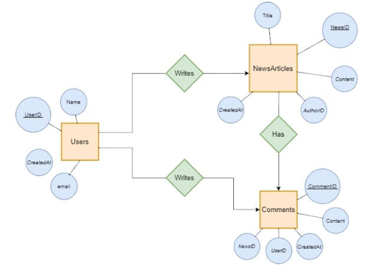

# Newsblog

Interview Project - G&S IT Group

[](https://www.w3schools.com/html/default.asp)
[](https://www.w3schools.com/css/default.asp)
[](https://www.w3schools.com/js/default.asp)
[](https://www.w3schools.com/php/default.asp)
[](https://www.w3schools.com/mysql/default.asp)

### Clone the project

```
$ git clone https://github.com/obisopulu/Newsblog-trial-test-G-S-IT-Group.git
$ cd newsblog
```

### Usage

1. Start `Apache Server` and visit [http://localhost/phpmyadmin](http://localhost/phpmyadmin/)
2. Create a new database `newsblog`
3. Import database dump [./data/db.sql](./data/db.sql) or [./data/db-mock.sql](./data/db-mock.sql)
4. Copy `.env` file
5. Visit [http://localhost/newsblog](http://localhost/newsblog/)

### Documentation


